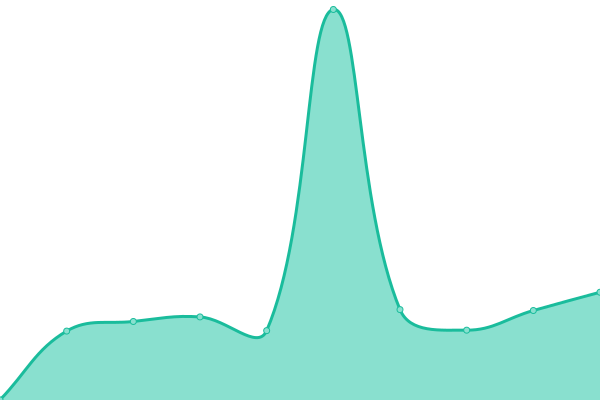

# [📈 Live Status](https://tbobm.github.io/etna-uptime): <!--live status--> **🟩 All systems operational**

This repository contains the open-source uptime monitor and status page for [Théo "Bob" Massard](https://www.linkedin.com/in/tbobm/), powered by [Upptime](https://github.com/upptime/upptime).

With [Upptime](https://upptime.js.org), you can get your own unlimited and free uptime monitor and status page, powered entirely by a GitHub repository. We use [Issues](https://github.com/tbobm/etna-uptime/issues) as incident reports, [Actions](https://github.com/tbobm/etna-uptime/actions) as uptime monitors, and [Pages](https://tbobm.github.io/etna-uptime) for the status page.

<!--start: status pages-->
<!-- This summary is generated by Upptime (https://github.com/upptime/upptime) -->
<!-- Do not edit this manually, your changes will be overwritten -->
<!-- prettier-ignore -->
| URL | Status | History | Response Time | Uptime |
| --- | ------ | ------- | ------------- | ------ |
|  [Intranet](https://intra.etna-alternance.net) | 🟩 Up | [intranet.yml](https://github.com/tbobm/etna-uptime/commits/HEAD/history/intranet.yml) | 

 517ms
     
 | 

<a href="https://tbobm.github.io/etna-uptime/history/intranet">89.85%</a>
    

|  [RocketChat](https://rocket.etna.io) | 🟩 Up | [rocket-chat.yml](https://github.com/tbobm/etna-uptime/commits/HEAD/history/rocket-chat.yml) | 

 964ms
     
 | 

<a href="https://tbobm.github.io/etna-uptime/history/rocket-chat">89.86%</a>
    

|  [Gitlab](https://rendu-git.etna-alternance.net/) | 🟩 Up | [gitlab.yml](https://github.com/tbobm/etna-uptime/commits/HEAD/history/gitlab.yml) | 

 780ms
     
 | 

<a href="https://tbobm.github.io/etna-uptime/history/gitlab">89.86%</a>
    

<!--end: status pages-->

[**Visit our status website →**](https://tbobm.github.io/etna-uptime)

## 📄 License

- Code: [MIT](./LICENSE) © [Théo "Bob" Massard](https://www.linkedin.com/in/tbobm/)
- Data in the `./history` directory: [Open Database License](https://opendatacommons.org/licenses/odbl/1-0/)
